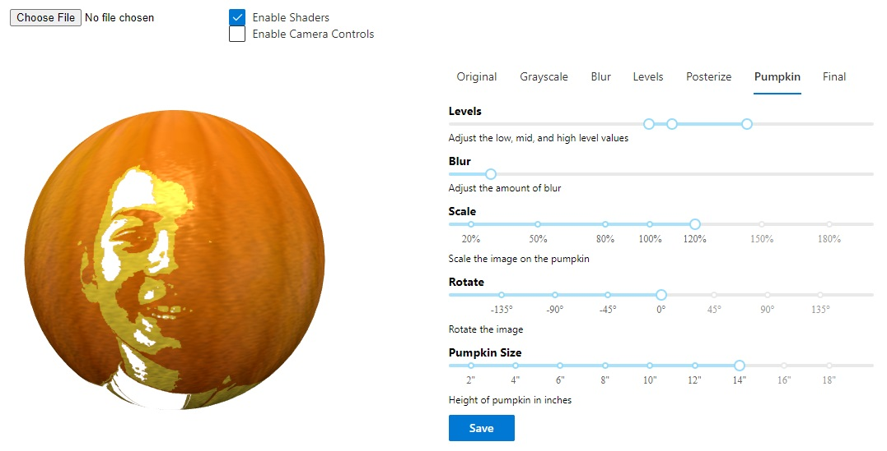
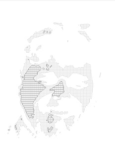
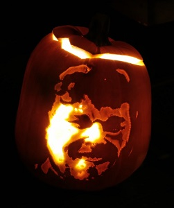

# Portrait Pumpkins

This project generates a single web ui page for generating a pumpkin carving template from an image. It was intended to help in carving portaits of people.

The final PDF file output can be printed and used as a template, similar to how other pumpkin carving kits work.

Running demo http://portraitpumpkin.okuda.ca/

More details http://notions.okuda.ca/2019/10/26/portrait-pumpkin-carving-app/

# Technical details

This project was bootstrapped with [Create React App](https://github.com/facebook/create-react-app).

It uses react, babylonjs, fluentui, rc-slider packages. It is built as React function components for high performance on mobile and desktop.

For performance it uses webgl shaders to implement each layer of image processing. A software version of each filter is also implemented for platforms without shader support.

## Getting Started

Requires node.js > 14.0.0 (tested with 16.13.2)

### `npm install`

Install the required dependencies

### `npm start`

Runs the app in the development mode. 
Open [http://localhost:3000](http://localhost:3000) to view it in the browser.

The page will reload if you make edits. 
You will also see any lint errors in the console.

### `npm run build`

Builds the app for production to the `build` folder. 
It correctly bundles React in production mode and optimizes the build for the best performance.

The build is minified and the filenames include the hashes. 
Your app is ready to be deployed!

See the section about [deployment](https://facebook.github.io/create-react-app/docs/deployment) for more information.
